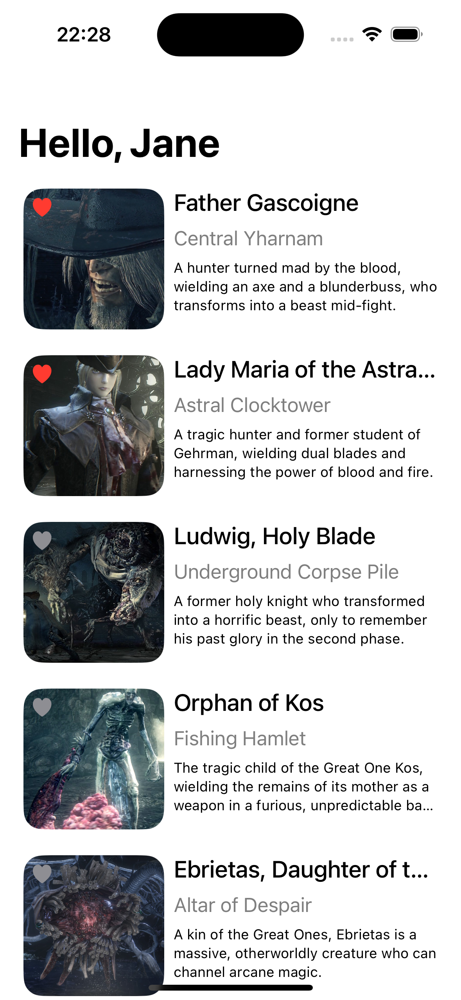
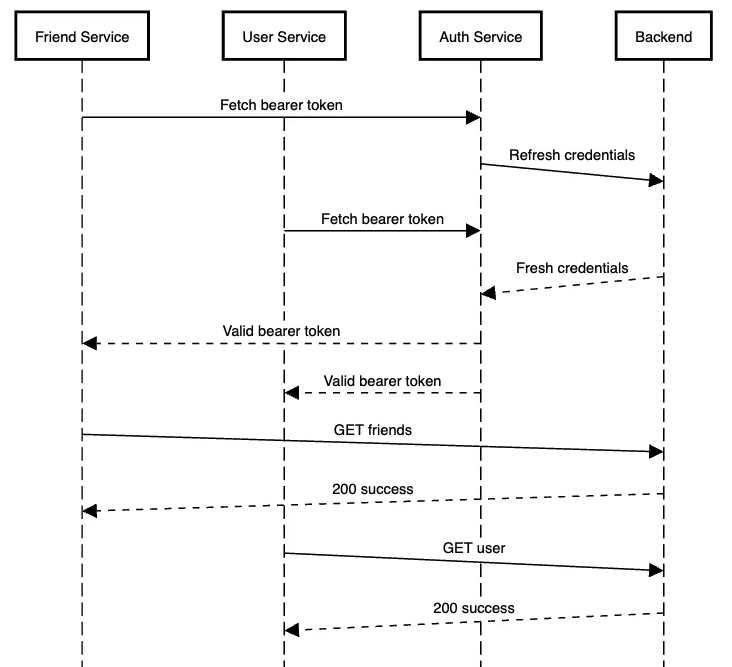

# Technical Test

1. Fetch boss data from the backend to display in the UI.
2. Implement the design in appendix #1.
3. Address the concurrency warnings.
4. Fetch User and Boss data in parallel.
5. Evaluate whether any unnecessary redraws are happening.
6. Our view model is marked @ObservedObject. Is this going to cause problems? If so, implement an alternative. 
7. In a future release, the app will include an infinitely-scrolling feed. Demonstrate how you could rebuild the main screen to support this.
8. The AuthService introduces a bottleneck. Diagnose the problem and ensure behaviour matches the sequence diagram in appendix #2.

### Appendix 1: Design 

### Appendix 2: Sequence Diagram 
.